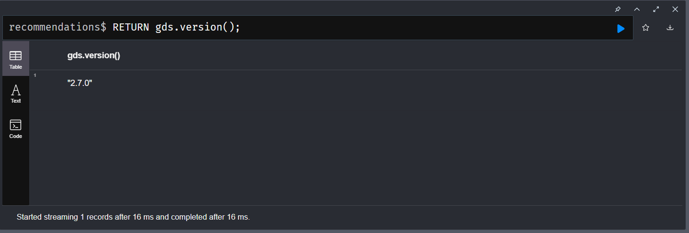

<!-- Auteurs Salam et Nesrine-->

# Insatallation de `Neo4J`


### Prérequis
- [**Java 17.x**](https://www.oracle.com/java/technologies/javase/jdk17-archive-downloads.html)
- [**IntelliJ IDEA**](https://intellij-idea.fr.download.it/)
- [**NEO4J 5.20**](https://neo4j.com/deployment-center/)
- [**Maven 3.9.6**](https://maven.apache.org/install.html)


### Créer la base de données `recommendations`
#### Note important

on a choisit la version entreprise car la version community contient certaines limitations.
Donc pour telecharger la version utilisée `neo4j entreprise 5.20` il suffit de cliquer sur ce [lien](https://neo4j.com/deployment-center/).


#### Version entreprise
```
create database <database name>
Exemple
 create database recommendations
```

Pour contourner nous allons modifier le fichier neo4j.conf
1. Aller neo4j-entreprise-5.20.0\conf
2. Ouvrir le fichier neo4j.conf
3. Téléchargez le fichier `apoc-5.20.0-extended.jar` en me connectant au lien suivant : [apoc 5.20.0 extended](https://github.com/neo4j-contrib/neo4j-apoc-procedures/releases)
4. Copiez le fichier téléchargé `apoc-5.20.0-extended.jar` dans le dossier `plugins`.
5. Créez le fichier `apoc.conf` et placez le dans le dossier "conf".
6. Pour pouvoir alimenter la base de données disponible en local, créez et mettez les lignes ci-dessous dans le fichier `apoc.conf` et enregistrez

```
apoc.import.file.use_neo4j_config=false
apoc.import.file.enabled=true
```

7. Puis, ouvrez le fichier neo4j.conf et décommentez la ligne suivante:

```
(#) server.directories.import=import
```


#### utiliser la base recommendations

```
use  <database name>
Exemple
    use recommendations
```

#### importation du fichier
1. Allez sur ce [lien](https://neo4j.com/labs/apoc/4.2/overview/apoc.cypher/apoc.cypher.runFile/) pour lire la documentation de `apoc.cypher.runFile`
2. saisissez la commande ci dessous dans le navigateur neo4j en modifiant le path.

path: chemin de votre fichier à importer dans la base de données, c'est l'enssemble de requete cypher.

_Dans notre cas : le chemin est "file:///C:/Users/TUF-GAMING/Desktop/Project_neo4j_MEJRI_Salam_BENAMOR_Nesrine/recommendations/projet-Neo4j/data/all-plain.cypher"_

```
CALL apoc.cypher.runFile('path');
```


#### graph data science

_Installer et configurer le plugin APOC :_

- Téléchargez le fichier JAR du plugin APOC depuis le [site](https://github.com/neo4j/graph-data-science/releases) ou bien ce [site]("https://neo4j.com/deployment-center/#gds-tab")
- Aprés avoir téléchargé le fichier JAR (version 2.7.0), Placez le dans le répertoire plugins de votre installation Neo4j.
- Modifiez le fichier `neo4j.conf` (généralement situé dans NEO4J_HOME/conf) pour permettre les appels aux procédures APOC :

Modifiez:
```
dbms.security.procedures.allowlist=gds.*
dbms.security.procedures.unrestricted=gds.*
```

- Redémarrez votre instance Neo4j pour appliquer les modifications.
- Vérifiez l’installation : Dans le navigateur Neo4j, exécutez la requête   `RETURN gds.version();` pour vérifier que GDS est installé.



- Maintenant vous pouvez tester vos requêtes CYPHER.

#### Appel procedure

- Pour pouvoir appeler les procedures dans NEO4J, il faut modfier le fichier `neo4j.conf`
  
Modifiez:
```
dbms.security.procedures.allowlist=apoc.coll.*,apoc.load.*,com.example.project.*,gds.*
dbms.security.procedures.unrestricted=my.extensions.example,my.procedures.*,com.example.project.*,gds.*
```

si vous avez des questions n'hesitez pas m'ecrire [📨](mailto:salam.mejri@gmail.com).